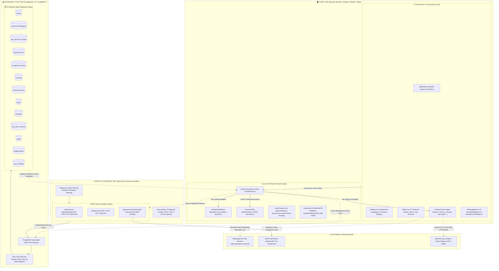
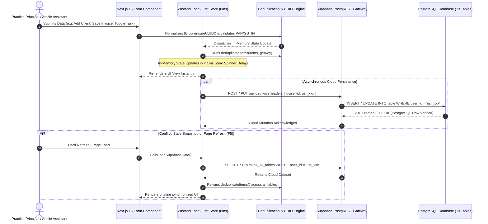
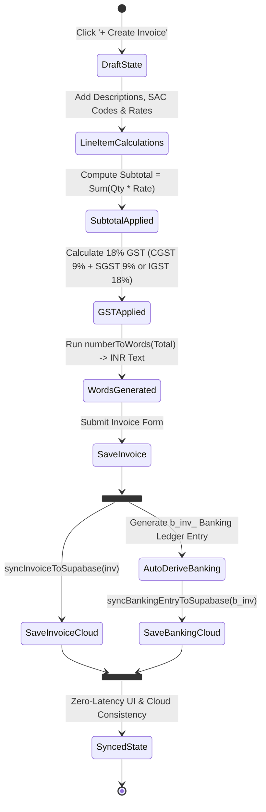

# Zplus CRM (CRM Expert) - Enterprise Practice Management & Statutory Compliance Workspace

[](https://github.com/your-org/CRM-tool)
[-black.svg)](https://nextjs.org/)
[](https://react.dev/)
[](https://supabase.com/)
[-orange.svg)](https://zustand-demo.pmnd.rs/)
[-brightgreen.svg)](./tests/run-all-tests.ts)
[](./next.config.ts)

---

## Executive Overview & Mission Statement

**Zplus CRM** (also branded as **CRM Expert**) is an enterprise-grade, local-first practice management and statutory compliance workspace engineered specifically for Indian professional accounting and corporate advisory practices: **Chartered Accountants (CAs), Tax Consultants, Company Secretaries (CS), Cost & Management Accountants (CMAs), and Corporate Legal Advisors**.

Indian compliance management operates in a high-stress regulatory environment governed by statutory deadlines across the **Goods & Services Tax Network (GSTN), Income Tax Department (ITD), Ministry of Corporate Affairs (MCA21/ROC), and TRACES**. Missing a statutory filing date triggers exponential late fees under Section 47 of the CGST Act, interest under Section 50, and severe client reputational loss.

Traditional firms attempt to manage these high-stakes operations using a fragile patchwork of disconnected Excel workbooks, physical register diaries, and unstructured WhatsApp chats. **Phase-1 MVP** completely unifies client directory management, encrypted portal credential storage, compliance package decomposition, service assignment, due date monitoring with 1-click WhatsApp alerts, 18% GST tax invoicing with INR words translation, real-time banking ledger reconciliation, and TipTap-powered statutory document drafting into a single, sub-millisecond local-first web application.

---

## Current Project Status: Phase-1 MVP (Completed & Active Stabilization)

- **Phase-1 MVP:** **100% IMPLEMENTED & VERIFIED** across all 13 relational database tables, local-first Zustand store, Next.js 16 edge API routes, and 108 automated test assertions.
- **Current Active Focus:** **Phase-1 MVP Stabilization & Hardening** (PostgreSQL query performance tuning, index optimization, connection pooling resilience via Supavisor, error boundary telemetry, and zero-PII security verification).
- **Living Documentation Standard:** Every feature, API, schema, and function documented below strictly exists within the active codebase.

---

## Table of Contents

1. [Architectural Diagrams (Full Project & Phase-1 MVP)](#1-architectural-diagrams-full-project--phase-1-mvp)
   - [Diagram A: Full-Stack Project Architecture](#diagram-a-full-stack-project-architecture)
   - [Diagram B: Phase-1 MVP Local-First Data Flow & Sync Pipeline](#diagram-b-phase-1-mvp-local-first-data-flow--sync-pipeline)
   - [Diagram C: Complete Relational Database ERD (All 13 Tables)](#diagram-c-complete-relational-database-erd-all-13-tables)
   - [Diagram D: Invoicing-to-Banking Ledger Transactional State Machine](#diagram-d-invoicing-to-banking-ledger-transactional-state-machine)
2. [The Genesis: Real Pain Points & Architectural Resolutions](#2-the-genesis-real-pain-points--architectural-resolutions)
3. [Exhaustive Technology Stack & Tools Present in Codebase](#3-exhaustive-technology-stack--tools-present-in-codebase)
4. [Relational Database Schema (All 13 Supabase Tables)](#4-relational-database-schema-all-13-supabase-tables)
5. [Complete Module Walkthrough & UI Wireframes (All 18 Views)](#5-complete-module-walkthrough--ui-wireframes-all-18-views)
6. [API Routes & Server Endpoints Specification](#6-api-routes--server-endpoints-specification)
7. [Core Library Functions & Methods Reference](#7-core-library-functions--methods-reference)
8. [Automated Testing Matrix (108 Assertions)](#8-automated-testing-matrix-108-assertions)
9. [Local Development, Environment Setup & Deployment](#9-local-development-environment-setup--deployment)
10. [Security, Privacy & Zero-PII Compliance](#10-security-privacy--zero-pii-compliance)


---

## 1. Architectural Diagrams (Full Project & Phase-1 MVP)

### Diagram A: Full-Stack Project Architecture

This diagram illustrates the comprehensive multi-tier architecture spanning the client browser, Next.js 16 server layer, security proxy, local-first reactive caching engine, and Supabase cloud infrastructure:



---

### Diagram B: Phase-1 MVP Local-First Data Flow & Sync Pipeline

This diagram shows the exact data execution pipeline developed in Phase-1 MVP that guarantees 0ms UI responsiveness while maintaining database integrity in Supabase:



---

### Diagram C: Complete Relational Database ERD (All 13 Tables)

Every table, primary key, foreign key, and cascade relationship active in PostgreSQL:


---

### Diagram D: Invoicing-to-Banking Ledger Transactional State Machine




---

## 2. The Genesis: Real Pain Points & Architectural Resolutions

### Real-World Practice Pain Points

Indian Chartered Accountancy, Tax Consultancy, and Corporate Law practices operate under distinct operational dynamics:

1. **Compliance Deadlines & Punitive Penalties:**
   - Statutory filings have non-negotiable monthly and quarterly due dates (e.g., GSTR-3B on the 20th, GSTR-1 on the 11th, TDS returns on the 31st of the subsequent month, Advance Tax quarterly instalments).
   - In a generic spreadsheet, tracking 100+ clients across 10 filing types leads to missed deadlines, attracting late fees under Section 47 of the CGST Act and interest under Section 50.
2. **Disconnected Invoicing and Payment Recovery:**
   - Invoicing is often treated as an afterthought in offline accounting software. Compliance work is completed, but fees remain unbilled or uncollected. There was no real-time link between a completed filing and its corresponding billing ledger.
3. **Portal Credential Sprawl & High Security Risk:**
   - A single firm manages hundreds of credentials across the GST Portal, Income Tax e-Filing, TRACES, MCA21/ROC, and DGFT.
   - Staff traditionally recorded these sensitive credentials in unencrypted spreadsheets, text files, or physical sticky notes, resulting in severe data leakage risks and operational chaos during staff turnover.
4. **Document Collection & Audit Trail Breakdown:**
   - Filing returns requires collecting source documents: bank statements, purchase registers, sales ledgers, and 26AS reconciliations.
   - Without a centralized document checklist per service, staff spent 40% of their workday repeatedly calling and messaging clients for missing documents.
5. **Multi-Staff Desynchronization:**
   - Multiple article assistants and paid assistants working on the same client lead to duplicate filings, overwriting of files, and a total lack of transparency for the principal partner.

---

### Engineering & Data Synchronization Pitfalls Overcome

During the early development iterations of Phase-1, the application experienced critical frontend-to-cloud synchronization failures documented in detail in our diagnostic post-mortem (`ERROR_LOG.md`). Solving these issues established the robust foundation of **Phase-1 MVP**:

```
       EARLY FLAW (Race Condition & ID Mismatch):
       [Browser Form] -> Generates "c_1787165518211" -> Saves to Memory Store
             |
             v (Background Direct SDK Push)
       [Supabase Client] -> Converts ID to UUID -> Saves "60426bb0-c00e-..."
             |
             +---> Realtime Listener fires snapshot -> Refetches parent records
                   before child cascade finishes -> Deleted items reappeared!
             |
             +---> Identity fragmented: "usr_default_account" vs authenticated email
                   On F5 refresh -> Data appeared missing!

       PHASE-1 MVP ARCHITECTURAL RESOLUTION:
       [Browser Form] -> Deterministic UUID via ensureUUID() -> Instant Local-First Zustand
             |
             +---> Synchronous getUserIdSync() eliminates session race condition
             +---> Atomic Next.js Edge Server API Routes (/api/clients, /api/services)
             +---> In-Memory & Database Deduplication Engine (deduplicateItems)
             +---> Transactional Cascade: Parent + Children + Banking ledger synchronized
```

#### Key Lessons & Resolutions:
- **Identity Fragmentation (`user_id` Scoping):** The application previously suffered from async session resolution delays where requests defaulted to `"usr_default_account"` while the user was authenticated under their specific account. This caused records to "vanish" on refresh. **Resolved:** Implemented synchronous identity extraction (`getUserIdSync()`) coupled with automatic schema migrations to reassign legacy records.
- **ID Format Asymmetry (`c_timestamp` vs `UUID`):** PostgreSQL columns typed as `UUID` rejected or hashed client timestamp IDs, breaking foreign key cascades. **Resolved:** Implemented `ensureUUID()` directly at UI inception, guaranteeing identical UUIDv4 strings across both client memory and PostgreSQL tables.
- **Realtime Subscription Race Conditions:** Realtime database listeners prematurely refetched data mid-cascade, resurrecting deleted rows in the UI. **Resolved:** Replaced naive global change listeners with targeted mutations, deduplicated refresh triggers, and strict primary-key matching.
- **Client-Side SDK vs Server API Routes:** Direct browser-to-Supabase calls were susceptible to browser extension interference and unhandled CORS errors. **Resolved:** Built robust Next.js API endpoints (`/api/clients`, `/api/services`) with verified user headers and strict JSON validation.

---

## 3. Exhaustive Technology Stack & Tools Present in Codebase

Below is the complete engineering matrix of every framework, programming language, runtime, library, tool, and API actually present and executed within the project:

### Programming Languages & Runtimes
| Technology | Version / Standard | Purpose & Codebase Location |
| :--- | :--- | :--- |
| **TypeScript** | v5.x (Strict Mode) | Strong typing across all 13 entities, store actions, API contracts (`tsconfig.json`, `src/lib/types.ts`). |
| **JavaScript** | ES2024 / Node.js 20+ / 24 LTS | Server runtime for Next.js SSR, Route Handlers, and test execution runner. |
| **SQL** | PostgreSQL 15 Dialect | Relational schemas, Row-Level Security (RLS) policies, and foreign key cascades. |
| **HTML5 & CSS3** | Modern Standards | Semantic document structure, CSS variables, dark/light themes, and responsive design (`src/app/globals.css`). |

---

### Core Frameworks & Application Architecture
| Framework / Engine | Version | Rationale & Codebase Location |
| :--- | :--- | :--- |
| **Next.js** | v16.3.0 | Modern App Router, React Server Components (RSC), Edge Route Handlers, Turbopack (`next.config.ts`, `src/app/`). |
| **React** | v19.2.4 | Concurrent rendering, modern hooks (`useActionState`, `useTransition`), context providers. |
| **Zustand** | v5.0.14 | Local-First state store providing sub-millisecond (0ms) reactive UI updates (`src/lib/store.ts`). |
| **Supabase Client** | v2.110.8 | PostgREST automated REST engine, PostgreSQL 15, and Realtime WebSocket event listeners (`src/lib/supabase.ts`, `src/lib/supabaseData.ts`). |

---

### UI Component Primitives & Styling Engines
| Library | Version | Functional Role in Codebase |
| :--- | :--- | :--- |
| **Tailwind CSS** | v4.0.0 | Utility-first styling engine with native PostCSS plugin, color tokens, and layout rules (`postcss.config.mjs`, `src/app/globals.css`). |
| **Radix UI Primitives** | Latest Modular | Accessible (WAI-ARIA compliant) headless primitives: Dialog, Dropdown Menu, Tabs, Popover, Select, Tooltip, Switch, Checkbox, Scroll Area, Alert Dialog. |
| **Lucide React** | v1.25.0 | Complete modern icon set for enterprise accounting interfaces (`src/components/Sidebar.tsx`, `src/components/Topbar.tsx`). |
| **Framer Motion** | v12.42.2 | Smooth layout transitions, modal animations, and collapsible sidebar state interpolation. |
| **Sonner** | v2.0.7 | Toast notification engine for instant action confirmations and network error alerts. |
| **Next Themes** | v0.4.6 | Seamless dark mode / light mode theme toggle with zero flash of unstyled content. |

---

### Form Handling, Rich Text & Document Processing
| Tool / Library | Version | Functional Role in Codebase |
| :--- | :--- | :--- |
| **React Hook Form** | v7.82.0 | Performant, uncontrolled form management for high-density client and invoice data entry. |
| **Zod** | v4.4.3 | Declarative schema validation for client inputs, PAN formats, GSTIN structures, and API payloads. |
| **TipTap** | v3.28.0 | Headless ProseMirror WYSIWYG editor with StarterKit, Table extensions, and alignment plugins (`src/app/drafts/page.tsx`). |
| **SheetJS (xlsx)** | v0.18.5 | Client-side spreadsheet generation and Excel parsing with UTF-8 Byte Order Mark (BOM) support. |

---

### Visualization, Communications & Transactional Tools
| Tool / API | Version | Functional Role in Codebase |
| :--- | :--- | :--- |
| **Recharts** | v3.10.0 | Composable SVG analytics: BarChart, PieChart, Donut, and monthly billing trend curves (`src/app/page.tsx`). |
| **Nodemailer** | v9.0.4 | Transactional SMTP engine for dispatching 6-digit OTP verification codes (`src/app/api/send-otp/route.ts`). |
| **WhatsApp Direct URL** | Standard Scheme | Formats and encodes one-click WhatsApp client reminders (`src/lib/utils.ts -> getWhatsAppLink()`). |
| **date-fns** | v4.4.0 | Date math: Indian Financial Year offsets, countdown calculations, and differenceInDays calculation (`src/lib/utils.ts`). |

---

### Build, Linting & Testing Tooling
| Tool | Version | Purpose in Codebase |
| :--- | :--- | :--- |
| **TSX** | v4.23.12 | Ultra-fast TypeScript execution engine for executing the 108-assertion automated test suite (`npm test`). |
| **ESLint** | v9.x | Enforces code quality, Next.js best practices, and React 19 rules (`eslint.config.mjs`). |
| **PostCSS** | v4.x | CSS transformation pipeline for Tailwind CSS compilation. |


---

## 4. Relational Database Schema (All 13 Supabase Tables)

The PostgreSQL database consists of 13 strongly-typed tables scoped by `user_id` for complete multi-tenant isolation:

| Table Name | Primary Key | Description & Scope | Key Columns & Data Types |
| :--- | :--- | :--- | :--- |
| **`clients`** | `id` (text / UUID) | Master Client Directory storing Proprietorships, Private Limiteds, LLPs, Partnerships, and Individuals. | `name` (text), `owner_name` (text), `type` (text), `phone` (text), `mobile` (text), `email` (text), `pan` (text), `gstin` (text), `city` (text), `state` (text), `portal_credentials` (jsonb), `documents` (jsonb), `user_id` (text) |
| **`services`** | `id` (text / UUID) | Compliance Package Master defining recurring statutory packages offered by the firm. | `name` (text), `price` (numeric), `recurrence` (text: MONTHLY / QUARTERLY / ANNUAL / CUSTOM), `due_date_day` (integer), `user_id` (text) |
| **`sub_services`** | `id` (text / UUID) | Granular filing tasks under a parent service package (e.g. GSTR-3B Return Filing). | `service_id` (FK -> services.id), `name` (text), `due_date` (text), `recurrence` (text), `user_id` (text) |
| **`required_docs`** | `id` (text / UUID) | Document compliance checklist items required before filing a sub-service. | `sub_service_id` (FK -> sub_services.id), `name` (text), `is_mandatory` (boolean), `user_id` (text) |
| **`assigned_services`**| `id` (text / UUID) | Client compliance assignment records mapped to specific Financial Years (e.g., FY 2025-26). | `client_id` (FK -> clients.id), `service_id` (FK -> services.id), `financial_year` (text), `due_date` (text), `amount_billed` (numeric), `amount_received` (numeric), `amount_pending` (numeric), `status` (text), `user_id` (text) |
| **`invoices`** | `id` (text / UUID) | Tax Invoices and Pro-Forma Invoices with itemized line items and 18% GST breakdown. | `type` (text: PROFORMA / INVOICE), `invoice_number` (text), `date` (text), `client_id` (FK -> clients.id), `items` (jsonb), `subtotal` (numeric), `gst_rate` (numeric), `gst_amount` (numeric), `total` (numeric), `amount_received` (numeric), `balance_due` (numeric), `status` (text: DRAFT / SENT / PAID), `user_id` (text) |
| **`banking_entries`** | `id` (text / UUID) | Financial billing and collection ledger derived directly from Tax Invoices for payment reconciliation. | `financial_year` (text), `client_id` (FK -> clients.id), `service_id` (text), `amount_billed` (numeric), `amount_received` (numeric), `amount_pending` (numeric), `payment_status` (text), `remark` (text), `user_id` (text) |
| **`leads`** | `id` (text / UUID) | Prospective sales inquiries from WhatsApp, Referrals, Website, or Direct Calls. | `name` (text), `mobile` (text), `email` (text), `source` (text), `city` (text), `status` (text: LEAD / CONTACTED / QUALIFIED / CONVERTED / LOST), `converted_client_id` (text), `user_id` (text) |
| **`renewals`** | `id` (text / UUID) | Annual recurring compliance jobs (e.g., Trademark Renewal, FSSAI License, Annual ROC Filing). | `client_name` (text), `service_name` (text), `due_date` (text), `from_date` (text), `to_date` (text), `progress` (text: To-do / In-progress / Completed), `user_id` (text) |
| **`one_time_services`**| `id` (text / UUID) | Ad-hoc, non-recurring corporate engagements (e.g., Company Incorporation, Partnership Deed Drafting). | `client_name` (text), `service_name` (text), `due_date` (text), `progress` (text: To-do / In-progress / Completed), `notes` (text), `user_id` (text) |
| **`drafts`** | `id` (text / UUID) | Legal and statutory document drafts (Engagement Letters, Scrutiny Responses, Power of Attorney). | `title` (text), `content` (text / HTML), `updated_at` (text), `user_id` (text) |
| **`collaborations`** | `id` (text / UUID) | Directory of external professional partners, CAs, Advocates, Valuers, and Service Vendors. | `name` (text), `number` (text), `email` (text), `type` (text: CA / ADVOCATE / VALUER / VENDOR), `notes` (text), `user_id` (text) |
| **`user_settings`** | `user_id` (PK) | Practice configuration: Firm Name, Registration Number, Base64 Digital Signature, Invoice Prefixes. | `settings` (jsonb payload storing firm profile, terms, signature image, bank details) |


---

## 5. Complete Module Walkthrough & UI Wireframes (All 18 Views)

This section details every view and component present in the application, including ASCII visual mockups, business logic, and click-by-click operational instructions.

---

### 1. Executive Dashboard (`/`)

The central analytics hub calculating real-time statutory metrics, compliance progress, and urgent due date action items.

```
+---------------------------------------------------------------------------------------------------+
|  zpluscrm  [ Global Search Ctrl+K ]                   [ FY 2025-26 v ]  [🔔]  [ PA ] Partner (CA) |
+---------------------------------------------------------------------------------------------------+
|  [CORE CRM]         |  FINANCIAL YEAR COMPLIANCE OVERVIEW (FY 2025-26)                            |
|  * Dashboard        |  +----------------+ +----------------+ +----------------+ +---------------+ |
|    Clients (124)    |  | TOTAL CLIENTS  | | TOTAL SERVICES | | TOTAL BILLED   | | OUTSTANDING   | |
|    Collabs (8)      |  |     124        | |       18       | | ₹ 18,45,000    | | ₹ 4,20,000    | |
|    Leads (14)       |  +----------------+ +----------------+ +----------------+ +---------------+ |
|  [OPERATIONS]       |                                                                             |
|    Packages         |  COMPLIANCE STATUS BREAKDOWN               MONTHLY BILLING TRENDS (RECHARTS)|
|    Services         |  [ Done: 68% | In-Progress: 22% | Pending: 10% ]  |  ||  ||  ||  ||  ||     |
|    Assign Packages  |                                                                             |
|    Clients by Svc   |  🚨 URGENT UPCOMING STATUTORY DUE DATES (< 7 DAYS)                          |
|  [FINANCIALS]       |  +--------------------+-------------------+------------+--------+--------+  |
|    Banking & Ledger |  | Client Name        | Compliance Task   | Due Date   | Status | Action |  |
|    Due Dates Cal    |  +--------------------+-------------------+------------+--------+--------+  |
|    Invoices         |  | Acme Enterprises   | GSTR-3B Filing    | 20-Oct-26  | 3 Days | [💬 WA]|  |
|    Drafts           |  | Nexus Global LLP   | TDS 26Q Return    | 31-Oct-26  | 7 Days | [💬 WA]|  |
|  [SYSTEM]           |  | Zenith Retailers   | Advance Tax Q3    | 15-Dec-26  | 45 Days| [💬 WA]|  |
|    Settings         |  +--------------------+-------------------+------------+--------+--------+  |
+---------------------------------------------------------------------------------------------------+
```

#### Step-by-Step How-to-Use Guide:
1. **Selecting the Financial Year:** Click the **FY Dropdown** in the Topbar to switch historical contexts (e.g., FY 2023-24, FY 2024-25, FY 2025-26). All metrics, assigned tasks, and banking summaries instantly recalculate.
2. **Reviewing Metrics:** Inspect the four primary stat cards (Total Clients, Active Packages, Gross Billed, and Total Outstanding Dues).
3. **Dispatching Quick Reminders:** Under the **Urgent Upcoming Statutory Due Dates** table, click the green **WhatsApp** button to immediately open a pre-filled client reminder with the specific tax task and deadline.

---

### 2. Master Client Directory (`/clients`)

The central directory for all business clients, holding legal entity details, PAN/GSTIN identifiers, contact coordinates, an encrypted portal credential vault, and document attachments.

```
+---------------------------------------------------------------------------------------------------+
|  CLIENT DIRECTORY                                             [ 📥 Export Excel ]  [ + New Client ]|
+---------------------------------------------------------------------------------------------------+
|  [🔍 Search by Client Name, PAN, GSTIN, Mobile...]   [ Filter by Type: All Types v ]             |
|                                                                                                   |
|  NAME / ENTITY         TYPE            MOBILE / EMAIL        PAN / GSTIN        PORTALS   ACTIONS  |
|  --------------------  --------------  --------------------  -----------------  --------  -------  |
|  Acme Enterprises Ltd  Private Ltd     +91 98000 00001       AAAAA0000A         [ 3 Keys] [✏️][🗑️]  |
|  Zenith Retailers      Proprietorship  +91 98000 00002       BBBBB0000B         [ 1 Key ] [✏️][🗑️]  |
|  Nexus Global LLP      LLP             +91 98000 00003       CCCCC0000C         [ 2 Keys] [✏️][🗑️]  |
|                                                                                                   |
|  +-- CLIENT ONBOARDING & VAULT DRAWER ---------------------------------------------------------+  |
|  | Basic Details: Entity Name, Constitution, Contact Person, Phone, Email, City, Address       |  |
|  | Identifiers: PAN (Auto-validated), GSTIN (Auto-validated 15-char format)                     |  |
|  | Portal Vault: GST Portal [User / Pass 👁️] | Income Tax [User / Pass 👁️] | TRACES [User / Pass]|  |
|  | File Repository: Incorporation Certificate, PAN Card Copy, MOA/AOA, GST Registration Cert  |  |
|  +---------------------------------------------------------------------------------------------+  |
+---------------------------------------------------------------------------------------------------+
```

#### Step-by-Step How-to-Use Guide:
1. **Onboarding a New Client:** Click **`+ New Client`**. A modal opens.
2. **Entering Entity Details:** Enter Legal Name, Owner/Contact Name, Mobile (10 digits), and Email.
3. **Validating Statutory Identifiers:** Input PAN (e.g. `AAAAA0000A`) and GSTIN (e.g. `27AAAAA0000A1Z5`). The built-in regular expression validators immediately verify the format.
4. **Storing Portal Credentials:** Expand the **Portal Credentials Vault** section. Add login credentials for GST, ITD, or MCA. Passwords are saved within the client record and can be toggled via the eyeball icon.
5. **Attaching Files:** Drag and drop client documents (e.g. GST Certificate). Click **`Save Client`**. The table updates immediately.
6. **Exporting Directory:** Click **`📥 Export Excel`** to download a spreadsheet with UTF-8 BOM encoding.

---

### 3. Service & Package Master (`/services`)

Defines standardized, recurring compliance packages offered to clients (e.g., "Comprehensive Corporate GST Package", "Monthly Bookkeeping & TDS").

```
+---------------------------------------------------------------------------------------------------+
|  COMPLIANCE PACKAGES MASTER (SERVICES)                                             [ + New Package ]|
+---------------------------------------------------------------------------------------------------+
|  Standardized bundles of compliance tasks billed periodically to clients.                        |
|                                                                                                   |
|  PACKAGE NAME                 RECURRENCE   BASE PRICE    DUE DAY OF MONTH   CHILD TASKS   ACTIONS |
|  ---------------------------  -----------  ------------  -----------------  ------------  ------- |
|  Monthly GST & TDS Package    MONTHLY      ₹ 6,500       20th of Month      4 Tasks       [✏️][🗑️] |
|  Annual Corporate ROC Filing  ANNUAL       ₹ 15,000      30th October       3 Tasks       [✏️][🗑️] |
|  Quarterly Advance Tax Care   QUARTERLY    ₹ 4,000       15th of End Month  2 Tasks       [✏️][🗑️] |
+---------------------------------------------------------------------------------------------------+
```

#### Step-by-Step How-to-Use Guide:
1. Click **`+ New Package`**.
2. Provide the Package Name (e.g., "Full Monthly Compliance").
3. Select Recurrence: **`MONTHLY`**, **`QUARTERLY`**, or **`ANNUAL`**.
4. Define Base Billing Price in INR (e.g., `5000`) and Default Due Day of the Month (e.g., `20` for GSTR-3B).
5. Click **`Save Package`**.

---

### 4. Granular Tasks / Sub-Services Master (`/sub-services`)

Decomposes broad compliance packages into specific filing tasks (e.g., under "Monthly GST Package", tasks include GSTR-1, GSTR-3B, and GSTR-2B Reconciliation).

```
+---------------------------------------------------------------------------------------------------+
|  SERVICES & STATUTORY TASKS (SUB-SERVICES)                                           [ + New Task ]|
+---------------------------------------------------------------------------------------------------+
|  [ Filter by Parent Package: Monthly GST & TDS Package v ]                                       |
|                                                                                                   |
|  TASK / SUB-SERVICE NAME     PARENT PACKAGE             STATUTORY DUE DATE    DOCS REQ    ACTIONS |
|  --------------------------  -------------------------  --------------------  ----------  ------- |
|  GSTR-1 Outward Return       Monthly GST & TDS Package  11th of every month   2 Docs      [✏️][🗑️] |
|  GSTR-3B Tax Return          Monthly GST & TDS Package  20th of every month   3 Docs      [✏️][🗑️] |
|  26Q TDS Filing              Monthly GST & TDS Package  31st after quarter    1 Doc       [✏️][🗑️] |
+---------------------------------------------------------------------------------------------------+
```

#### Step-by-Step How-to-Use Guide:
1. Click **`+ New Task`**.
2. Select the Parent Package from the dropdown.
3. Enter Task Name (e.g. `GSTR-3B Return Filing`).
4. Set the statutory recurring due date offset and description.
5. Click **`Save Task`**.

---

### 5. Required Documents Checklist (`/required-docs`)

Configures mandatory and optional client document checklists required before executing any statutory task.

```
+---------------------------------------------------------------------------------------------------+
|  REQUIRED DOCUMENTS MASTER                                                       [ + Add Document ]|
+---------------------------------------------------------------------------------------------------+
|  [ Filter by Task: GSTR-3B Tax Return v ]                                                        |
|                                                                                                   |
|  DOCUMENT NAME                        ASSOCIATED TASK        MANDATORY?   SAMPLE TEMPLATE ACTIONS |
|  -----------------------------------  ---------------------  -----------  --------------- ------- |
|  Monthly Bank Statement (PDF/Excel)   GSTR-3B Tax Return     REQUIRED     [📥 Template]   [✏️][🗑️] |
|  Sales Register / Outward Invoices    GSTR-3B Tax Return     REQUIRED     [📥 Template]   [✏️][🗑️] |
|  Purchase Register (with ITC notes)   GSTR-3B Tax Return     REQUIRED     [📥 Template]   [✏️][🗑️] |
|  Challan Payment Proofs               GSTR-3B Tax Return     OPTIONAL     -               [✏️][🗑️] |
+---------------------------------------------------------------------------------------------------+
```

#### Step-by-Step How-to-Use Guide:
1. Select the relevant task.
2. Click **`+ Add Document`**.
3. Specify the Document Title (e.g., "GSTR-2B Download").
4. Toggle the **`Is Mandatory?`** checkbox. When mandatory, compliance status cannot advance to "Completed" without file confirmation.

---

### 6. Compliance Package Assignment (`/assign`)

Enrolls clients into compliance packages for the selected Financial Year, mapping out billing commitments and due dates.

```
+---------------------------------------------------------------------------------------------------+
|  PACKAGE ASSIGNMENT (FY 2025-26)                                                   [ + Assign New ]|
+---------------------------------------------------------------------------------------------------+
|  CLIENT NAME            ASSIGNED PACKAGE          BILLED        RECEIVED      PENDING     STATUS  |
|  ---------------------  ------------------------  ------------  ------------  ----------  ------- |
|  Acme Enterprises Ltd   Monthly GST & TDS Package ₹ 78,000      ₹ 50,000      ₹ 28,000    ACTIVE  |
|  Zenith Retailers       Monthly GST & TDS Package ₹ 45,000      ₹ 45,000      ₹ 0         ACTIVE  |
|  Nexus Global LLP       Annual Corporate ROC      ₹ 15,000      ₹ 0           ₹ 15,000    ACTIVE  |
+---------------------------------------------------------------------------------------------------+
```

#### Step-by-Step How-to-Use Guide:
1. Ensure the active **Financial Year** is selected in the top bar.
2. Click **`+ Assign New`**.
3. Select the Client and the Compliance Package.
4. Set the Agreed Billing Amount for the year and initial advance received (if any).
5. Click **`Confirm Assignment`**. This creates the relational record and automatically provisions entries in the **Service Clients Grid** and **Banking Ledger**.


---

### 7. Service Clients Grid Matrix (`/service-clients`)

The central operational dashboard used by practice staff to track execution across every client and monthly task cycle.

```
+---------------------------------------------------------------------------------------------------+
|  CLIENT COMPLIANCE MATRIX (FY 2025-26)                          [ Filter Service: GST Package v ]|
+---------------------------------------------------------------------------------------------------+
|  CLIENT NAME          APR 25    MAY 25    JUN 25    JUL 25    AUG 25    SEP 25    OCT 25  ACTIONS |
|  -------------------  --------  --------  --------  --------  --------  --------  ------- ------- |
|  Acme Enterprises Ltd [DONE]    [DONE]    [DONE]    [DONE]    [DONE]    [IN-PROG] [TO-DO] [View]  |
|  Zenith Retailers     [DONE]    [DONE]    [DONE]    [DONE]    [OVERDUE] [TO-DO]   [TO-DO] [View]  |
|  Nexus Global LLP     [DONE]    [DONE]    [IN-PROG] [TO-DO]   [TO-DO]   [TO-DO]   [TO-DO] [View]  |
|                                                                                                   |
|  STATUS KEY:  🟢 [DONE] Completed  |  🟡 [IN-PROG] In Progress  |  🔴 [OVERDUE]  |  ⚪ [TO-DO]   |
+---------------------------------------------------------------------------------------------------+
```

#### Step-by-Step How-to-Use Guide:
1. Locate the client and relevant monthly column.
2. Click any cell to cycle its status: **`To-do`** -> **`In-progress`** -> **`Completed`**.
3. Status changes update locally (0ms) and persist to Supabase in the background.

---

### 8. Due Dates & Compliance Calendar (`/due-dates`)

Monitors all upcoming statutory due dates across the firm with countdown calculation and direct WhatsApp integration.

```
+---------------------------------------------------------------------------------------------------+
|  STATUTORY COMPLIANCE CALENDAR & DUE DATE MONITOR                   [ Filter: Due Next 15 Days v ]|
+---------------------------------------------------------------------------------------------------+
|  CLIENT NAME          COMPLIANCE FILING     DUE DATE     COUNTDOWN       BADGE      WHATSAPP ACTION|
|  -------------------  --------------------  -----------  --------------  ---------  ---------------|
|  Acme Enterprises Ltd GSTR-3B Return        20-Oct-2026  In 3 Days       [ URGENT ] [💬 Send Alert]|
|  Zenith Retailers     TDS Form 26Q Return   31-Oct-2026  In 14 Days      [ NORMAL ] [💬 Send Alert]|
|  Horizon Logistics    ROC AOC-4 Filing      30-Nov-2026  In 44 Days      [ SAFE   ] [💬 Send Alert]|
|  Vertex Exports       Advance Tax Q3        15-Dec-2026  In 59 Days      [ SAFE   ] [💬 Send Alert]|
+---------------------------------------------------------------------------------------------------+
```

#### Step-by-Step How-to-Use Guide:
1. Filter due dates by urgency: **`Overdue`**, **`Due in 7 Days`**, or **`All`**.
2. Click **`💬 Send Alert`** next to any record.
3. The system generates an encoded WhatsApp message link with standard templates:
   ```
   https://api.whatsapp.com/send?phone=919800000001&text=Dear%20Client%2C%20this%20is%20a%20reminder%20that%20your%20GSTR-3B%20Return%20is%20due%20on%2020-Oct-2026.%20Please%20submit%20your%20bank%20statements.
   ```
4. WhatsApp Web or Desktop opens immediately with the pre-filled text.

---

### 9. Tax Invoicing & Pro-Forma Engine (`/invoice`)

Generates GST-compliant Tax Invoices and Pro-Forma Invoices with itemized HSN/SAC codes, 18% GST calculation (CGST 9% + SGST 9% or IGST 18%), and Indian Number-to-Words INR conversion.

```
+---------------------------------------------------------------------------------------------------+
|  TAX INVOICES & PRO-FORMA BILLING                                              [ + Create Invoice ]|
+---------------------------------------------------------------------------------------------------+
|  [ Type: All v ]  [ Status: All v ]  [ FY: 2025-26 v ]              [ 📥 Export Invoices Summary ] |
|                                                                                                   |
|  INV NUMBER    TYPE       DATE         CLIENT NAME           TOTAL AMOUNT  RECEIVED   BALANCE STATUS|
|  ------------  ---------  -----------  --------------------  ------------  ---------  ------- ------|
|  INV/2026/042  INVOICE    12-Oct-2026  Acme Enterprises Ltd  ₹ 23,600      ₹ 23,600   ₹ 0     PAID  |
|  PRO/2026/018  PROFORMA   14-Oct-2026  Zenith Retailers      ₹ 11,800      ₹ 5,000    ₹ 6,800 PART  |
|                                                                                                   |
|  +-- INVOICE MODAL PREVIEW & GENERATOR --------------------------------------------------------+  |
|  | Bill To: Acme Enterprises Ltd (GSTIN: 27AAAAA0000A1Z5 | PAN: AAAAA0000A)                    |  |
|  | Invoice No: INV/2026/042 | Date: 12-Oct-2026 | Financial Year: 2025-26                       |  |
|  | Item 1: Statutory Audit & Tax Compliance Q2 [SAC: 998222] | Rate: ₹ 20,000 | Qty: 1         |  |
|  | Subtotal: ₹ 20,000.00                                                                       |  |
|  | GST Rate: 18.00% (CGST 9%: ₹ 1,800.00 | SGST 9%: ₹ 1,800.00)                                |  |
|  | Grand Total: ₹ 23,600.00                                                                    |  |
|  | Amount in Words: INR Twenty Three Thousand Six Hundred Rupees Only.                         |  |
|  | [ 🖨️ Print / Download PDF ]  [ 💾 Save & Sync Ledger ]  [ ❌ Cancel ]                       |  |
|  +---------------------------------------------------------------------------------------------+  |
+---------------------------------------------------------------------------------------------------+
```

#### Step-by-Step How-to-Use Guide:
1. Click **`+ Create Invoice`**.
2. Select Document Type: **`Tax Invoice`** or **`Pro-Forma Invoice`**.
3. Select Client. The client's GSTIN, PAN, and address are automatically populated.
4. Add line items: Service Description, SAC/HSN code, Quantity, and Base Rate.
5. The system computes **Subtotal**, applies **18% GST**, computes **Grand Total**, and calculates the INR text via `numberToWords()`.
6. Enter Amount Received and Payment Mode (Cash, NEFT/RTGS, UPI).
7. Click **`Save & Sync`**.
8. **Automatic Ledger Link:** Creating a Tax Invoice automatically creates a linked entry in the **Banking Ledger** (`b_inv_<id>`), keeping billing and cash-flow in sync.

---

### 10. Banking & Payment Reconciliation Ledger (`/banking`)

Provides a comprehensive financial reconciliation ledger tracking every billed item, payment received, and outstanding balance across clients.

```
+---------------------------------------------------------------------------------------------------+
|  BANKING & FINANCIAL RECONCILIATION LEDGER (FY 2025-26)                     [ 📥 Export to Excel ]|
+---------------------------------------------------------------------------------------------------+
|  SUMMARY:  Total Billed: ₹ 18,45,000  |  Total Received: ₹ 14,25,000  |  Pending: ₹ 4,20,000       |
|                                                                                                   |
|  CLIENT NAME          FINANCIAL YEAR   BILLED AMOUNT   AMOUNT RECEIVED  PENDING DUES  PAYMENT STAT |
|  -------------------  ---------------  --------------  ---------------  ------------  ------------ |
|  Acme Enterprises Ltd FY 2025-26       ₹ 78,000        ₹ 50,000         ₹ 28,000      [ PARTIAL ]  |
|  Zenith Retailers     FY 2025-26       ₹ 45,000        ₹ 45,000         ₹ 0           [ PAID    ]  |
|  Nexus Global LLP     FY 2025-26       ₹ 15,000        ₹ 0              ₹ 15,000      [ OVERDUE ]  |
+---------------------------------------------------------------------------------------------------+
```

#### Step-by-Step How-to-Use Guide:
1. Review overall firm receivables in the top summary bar.
2. Click any entry to update **Amount Received** upon client payment clearance.
3. **`Pending Dues`** and **`Payment Status`** update automatically in real time.

---

### 11. Statutory Renewals & Annual Roll-Forward (`/renewals`)

Tracks long-cycle annual or multi-year statutory jobs such as Trademark Renewals, FSSAI Licenses, Import Export Codes (IEC), and Annual ROC filings.

```
+---------------------------------------------------------------------------------------------------+
|  ANNUAL STATUTORY RENEWALS                                                        [ + Add Renewal ]|
+---------------------------------------------------------------------------------------------------+
|  CLIENT NAME          SERVICE / LICENSE      VALID FROM    DUE DATE      PROGRESS    ROLL-FORWARD |
|  -------------------  ---------------------  ------------  ------------  ----------  ------------ |
|  Acme Enterprises Ltd Trademark Class 9      01-Apr-2016   31-Mar-2026   [To-do]     [ ⏩ Renew ] |
|  Zenith Retailers     FSSAI State License    15-May-2023   14-May-2026   [In-prog]   [ ⏩ Renew ] |
|  Nexus Global LLP     IEC Annual Renewal     01-Apr-2025   30-Jun-2026   [Completed] [ ⏩ Renew ] |
+---------------------------------------------------------------------------------------------------+
```

#### Step-by-Step How-to-Use Guide:
1. Click **`+ Add Renewal`** to record a license or recurring task with its target expiry date.
2. **The 1-Click Roll-Forward Engine:** When a renewal is completed, click **`⏩ Renew`**. The system advances the validity period and due date to the subsequent year (or renewal interval) without re-entering client data.

---

### 12. One-Time Ad-Hoc Projects (`/one-time-services`)

Manages ad-hoc advisory assignments that do not recur periodically (e.g., Private Limited Incorporation, GST Registration, Drafting Partnership Deed).

```
+---------------------------------------------------------------------------------------------------+
|  ONE-TIME ADVISORY & INCORPORATION SERVICES                                    [ + New Assignment ]|
+---------------------------------------------------------------------------------------------------+
|  CLIENT / APPLICANT   ASSIGNMENT DESCRIPTION     TARGET DEADLINE    PROGRESS STATUS   NOTES       |
|  -------------------  -------------------------  -----------------  ----------------  ----------- |
|  Innovatech Solutions Private Ltd Incorporation  15-Nov-2026        [ In-progress ]   SPICe+ filed|
|  Metro Real Estate    GST New Registration       25-Oct-2026        [ Completed   ]   ARN received|
|  Sterling Capital     HUF Deed Drafting          10-Nov-2026        [ To-do       ]   Awaiting Pan|
+---------------------------------------------------------------------------------------------------+
```

#### Step-by-Step How-to-Use Guide:
1. Click **`+ New Assignment`**.
2. Enter the applicant/client name, service description, and target deadline.
3. Track progress through **`To-do`**, **`In-progress`**, and **`Completed`**.

---

### 13. Legal & Statutory Document Drafts (`/drafts`)

A full-featured WYSIWYG legal document editor powered by **TipTap 3.28**, allowing firms to draft, format, store, and print professional statutory documents.

```
+---------------------------------------------------------------------------------------------------+
|  LEGAL & STATUTORY DOCUMENT DRAFTS                                                   [ + New Draft ]|
+---------------------------------------------------------------------------------------------------+
|  TEMPLATES: [ Statutory Audit Engagement Letter ]  [ Notice Response Sec 142(1) ]  [ POA Draft ]   |
|                                                                                                   |
|  +-- TIPTAP WYSIWYG EDITOR --------------------------------------------------------------------+  |
|  | [B] [I] [U] [H1] [H2] [Bullet List] [Numbered List] [Table v] [Align Left/Center/Right]     |  |
|  |---------------------------------------------------------------------------------------------|  |
|  | ENGAGEMENT LETTER FOR STATUTORY AUDIT UNDER SECTION 139 OF THE COMPANIES ACT, 2013       |  |
|  |                                                                                             |  |
|  | To The Board of Directors,                                                                  |  |
|  | Acme Enterprises Private Limited                                                            |  |
|  | Business District, Mumbai - 400001                                                          |  |
|  |                                                                                             |  |
|  | Dear Sirs,                                                                                  |  |
|  | We are pleased to confirm our acceptance and our understanding of this engagement...        |  |
|  | +-----------------------------+------------------------------------+                        |  |
|  | | Scope of Audit              | Compliance Framework               |                        |  |
|  | +-----------------------------+------------------------------------+                        |  |
|  | | Financial Statements FY25-26| Indian Accounting Standards (IndAS)|                        |  |
|  | +-----------------------------+------------------------------------+                        |  |
|  +---------------------------------------------------------------------------------------------+  |
|  [ 💾 Save Draft to Cloud ]    [ 🖨️ Print / Download PDF ]    [ 🗑️ Delete Draft ]                  |
+---------------------------------------------------------------------------------------------------+
```

#### Step-by-Step How-to-Use Guide:
1. Click **`+ New Draft`** or select a pre-configured template (Engagement Letter, Tax Audit Terms, Representation Letter).
2. Format text using the toolbar: headings, bold/italic/underline, alignments, and structured tables.
3. Click **`💾 Save Draft to Cloud`**. The document is synchronized directly with the `drafts` table in Supabase.
4. Click **`🖨️ Print / Download PDF`** to print on firm letterhead.

---

### 14. WhatsApp Leads & Sales Conversion Pipeline (`/leads`)

Captures incoming sales inquiries and streamlines the transition from prospect to active client.

```
+---------------------------------------------------------------------------------------------------+
|  WHATSAPP & PROSPECT LEADS PIPELINE                                                   [ + Add Lead ]|
+---------------------------------------------------------------------------------------------------+
|  [ Filter: Active Leads v ]                                                                       |
|                                                                                                   |
|  PROSPECT NAME        PHONE / MOBILE   SOURCE       CITY        STATUS       ACTIONS              |
|  -------------------  ---------------  -----------  ----------  -----------  -------------------  |
|  Pinnacle Logistics   +91 98000 00010  WHATSAPP     Hyderabad   [QUALIFIED]  [ 🤝 Convert Client]|  |
|  Metro Enterprises    +91 98000 00011  REFERRAL     Bangalore   [CONTACTED]  [ ✏️ Edit ]          |  |
|  Green Leaf Retail    +91 98000 00012  WEBSITE      Chennai     [LEAD]       [ ✏️ Edit ]          |  |
+---------------------------------------------------------------------------------------------------+
```

#### Step-by-Step How-to-Use Guide:
1. Click **`+ Add Lead`** when a client reaches out via WhatsApp, phone, or referral.
2. Track discussion stage: **`LEAD`** -> **`CONTACTED`** -> **`QUALIFIED`**.
3. **The 1-Click Client Conversion Engine:** Click **`🤝 Convert Client`**. The system:
   - Creates a new record in the `clients` directory with contact coordinates pre-populated.
   - Marks the lead as `CONVERTED`.
   - Links the conversion record via `converted_client_id`.
   - Dispatches a success toast and redirects to package assignment.

---

### 15. Professional Collaborations Network (`/collaborations`)

Maintains an organized rolodex of external associate Chartered Accountants, Senior Advocates, Registered Valuers, Company Secretaries, and IT service providers.

```
+---------------------------------------------------------------------------------------------------+
|  EXTERNAL PROFESSIONAL COLLABORATIONS                                             [ + Add Partner ]|
+---------------------------------------------------------------------------------------------------+
|  PARTNER DESIGNATION  SPECIALIZATION   PHONE / WHATSAPP   EMAIL                 QUICK CONNECT     |
|  -------------------  ---------------  -----------------  --------------------  ----------------- |
|  Senior Counsel       GST Scrutiny     +91 98000 00021    counsel@example.com   [💬 Open WhatsApp]|
|  Audit Partner (CA)   Statutory Audit  +91 98000 00022    audit@example.com     [💬 Open WhatsApp]|
|  Registered Valuer    IBC Valuation    +91 98000 00023    valuer@example.com    [💬 Open WhatsApp]|
+---------------------------------------------------------------------------------------------------+
```

#### Step-by-Step How-to-Use Guide:
1. Click **`+ Add Partner`** and enter specialization, mobile number, and email.
2. Click **`💬 Open WhatsApp`** to immediately initiate direct external advisory discussions.

---

### 16. Smart Automations Hub (`/automations`)

Central configuration center for practice reminder schedules, auto-reconciliation thresholds, and WhatsApp communication rules.

```
+---------------------------------------------------------------------------------------------------+
|  SMART PRACTICE AUTOMATIONS & TRIGGERS                                                            |
+---------------------------------------------------------------------------------------------------+
|  [⚡] AUTO WHATSAPP DUE DATE ALERTS                                                    [ ENABLED ] |
|      Triggers automatic reminder links 7 days and 2 days before statutory due dates.              |
|                                                                                                   |
|  [⚡] INVOICE-TO-BANKING AUTO-LEDGER SYNCHRONIZATION                                   [ ENABLED ] |
|      Generates linked ledger entry (b_inv_<id>) immediately upon Tax Invoice creation.            |
|                                                                                                   |
|  [⚡] 1-CLICK ANNUAL ROLL-FORWARD ENGINE                                               [ ENABLED ] |
|      Advances recurring statutory renewals to the subsequent fiscal year automatically.           |
+---------------------------------------------------------------------------------------------------+
```

---

### 17. Practice Settings, Branding & Digital Signatures (`/settings`)

Allows practice principals to configure firm details, customize invoice numbering sequences, and upload digital signatures.

```
+---------------------------------------------------------------------------------------------------+
|  PRACTICE SETTINGS & FIRM CUSTOMIZATION                                          [ 💾 Save Changes ]|
+---------------------------------------------------------------------------------------------------+
|  FIRM IDENTITY:                                                                                   |
|  Firm Name:      Premier Practice & Co., Chartered Accountants                                    |
|  Firm Regn No:   XXXXXXN (ICAI)             GSTIN: 27XXXXX0000X1Z5                                |
|  Office Address: Corporate Plaza, Suite 400, Financial District, Mumbai - 400001                  |
|                                                                                                   |
|  BILLING PREFERENCES:                                                                             |
|  Tax Invoice Prefix:     [ INV/2026/ ]     Pro-Forma Prefix: [ PRO/2026/ ]                        |
|  Default Due Date Window: 15 Days          Default GST Rate: 18.00%                               |
|                                                                                                   |
|  DIGITAL SIGNATURE & STAMP:                                                                       |
|  [ 📂 Upload Signature Image (PNG) ]  -->  Preview: [ Digitally Signed by Authorized Signatory ]   |
|                                                                                                   |
|  DANGER ZONE / DATA GOVERNANCE:                                                                   |
|  [ 🧹 Purge Duplicate Rows ]      [ ⚠️ Purge All Practice Data (Requires 'CONFIRM' input) ]       |
+---------------------------------------------------------------------------------------------------+
```

#### Step-by-Step How-to-Use Guide:
1. Configure Firm Legal Name, ICAI Registration Number, and Firm GSTIN.
2. Customize Invoice Prefixes (e.g. `INV/2026/`).
3. Upload Partner Digital Signature / Stamp (stored as Base64 in `user_settings`). The signature renders dynamically on generated Tax Invoices.
4. Save preferences to persist across all browser instances.

---

### 18. Cross-Cutting Productivity Tools

- **Global Command Palette (`Ctrl+K` / `Cmd+K`):** Instant modal search across all clients, PANs, GSTINs, packages, and invoices.
- **Floating Quick Notes:** Scratchpad widget available on every view. Notes persist locally and across browser sessions for immediate jotting during client calls.
- **AI Copilot Widget:** Dockable assistance drawer featuring specialized prompt shortcuts for Indian tax queries, Section references, and statutory penalties.

---

## 6. API Routes & Server Endpoints Specification

Next.js Edge Server API routes provide secure, authenticated endpoints that abstract direct database queries:

```
GET    /api/clients          - Retrieve all clients scoped to x-user-id
POST   /api/clients          - Create a new client record with normalized UUID
DELETE /api/clients          - Bulk or scoped deletion of clients

GET    /api/clients/[id]     - Fetch single client record by UUID
PUT    /api/clients/[id]     - Update existing client properties
DELETE /api/clients/[id]     - Delete specific client and cascade dependencies

GET    /api/services         - List all compliance packages
POST   /api/services         - Create new service package
PUT    /api/services         - Update service details
DELETE /api/services         - Remove service package

POST   /api/send-otp         - Dispatch 6-digit verification code via Nodemailer
```

### API Contract Details:

#### 1. `GET /api/clients`
- **Headers:** `x-user-id: usr_account_partition_id`
- **Response (200 OK):**
```json
{
  "success": true,
  "data": [
    {
      "id": "60426bb0-c00e-4001-8871-655182110000",
      "user_id": "usr_account_partition_id",
      "name": "Acme Enterprises Private Limited",
      "type": "PRIVATE_LIMITED",
      "mobile": "9800000001",
      "pan": "AAAAA0000A",
      "gstin": "27AAAAA0000A1Z5"
    }
  ],
  "count": 1
}
```

#### 2. `POST /api/send-otp`
- **Request Body:**
```json
{
  "email": "practitioner@example.com",
  "code": "849201",
  "name": "Authorized Partner"
}
```
- **Response (200 OK):**
```json
{
  "success": true,
  "message": "OTP verification code dispatched successfully."
}
```


---

## 7. Core Library Functions & Methods Reference

### Utility Functions (`src/lib/utils.ts`)

- **`ensureUUID(id?: string): string`**  
  Normalizes any ID to a deterministic, valid UUIDv4 string. If passed an existing UUID, returns it unchanged; if passed a legacy timestamp string (e.g. `c_1787165518211`), calculates an MD5-style alphanumeric hash and formats it into the 8-4-4-4-12 UUID layout.
- **`numberToWords(num: number): string`**  
  Converts financial amounts into formal Indian Currency nomenclature (Crores, Lakhs, Thousands, Hundreds, Rupees).  
  *Example:* `23600` -> `"INR Twenty Three Thousand Six Hundred Rupees Only."`
- **`validatePAN(pan: string): boolean`**  
  Validates Indian Permanent Account Number using statutory regex `^[A-Z]{5}[0-9]{4}[A-Z]{1}$`.
- **`validateGSTIN(gstin: string): boolean`**  
  Validates 15-character Goods & Services Tax Identification Number via regex `^[0-9]{2}[A-Z]{5}[0-9]{4}[A-Z]{1}[1-9A-Z]{1}Z[0-9A-Z]{1}$`.
- **`validatePhone(phone: string): boolean`**  
  Strips formatting and ensures 10-digit Indian mobile validity starting with 6, 7, 8, or 9.
- **`getCurrentFY(): string`**  
  Computes active Indian Financial Year (April 1 to March 31).  
  *Example:* In August 2026, returns `"2026-27"`.
- **`getFYOptions(): string[]`**  
  Returns array of historical and upcoming FY strings for dropdown selection.
- **`getWhatsAppLink(mobile?: string, message?: string): string`**  
  Formats and URL-encodes a direct `api.whatsapp.com/send` link.
- **`getDueBadgeColor(days: number): string`**  
  Returns color token: Red for overdue / < 7 days, Orange for < 30 days, Green for safe.
- **`formatCurrency(amount: number): string`**  
  Formats numeric figures into Indian numbering format with rupee symbol (`₹ 1,50,000`).

---

### Store State & Actions (`src/lib/store.ts`)

The application state is driven by `useAppStore` (Zustand). Key actions:

- **`loadSupabaseData()`**: Hydrates in-memory state with cloud data scoped to the active `user_id`.
- **`addClient(c)` / `updateClient(c)` / `deleteClient(id)`**: Optimistic CRUD operations on clients.
- **`addService(s)` / `updateService(s)` / `deleteService(id)`**: Compliance packages management.
- **`addSubService(ss)` / `updateSubService(ss)` / `deleteSubService(id)`**: Task decomposition management.
- **`addAssignedService(a)` / `updateAssignedService(a)` / `deleteAssignedService(id)`**: FY client package enrollment.
- **`addInvoice(inv)` / `updateInvoice(inv)` / `deleteInvoice(id)`**: Invoicing engine; automatically handles banking ledger link (`b_inv_<id>`).
- **`addBankingEntry(b)` / `updateBankingEntry(b)` / `deleteBankingEntry(id)`**: Ledger management.
- **`convertLead(leadId, clientId)`**: Automates 1-click lead conversion into an active client record.
- **`renewService(id)`**: Executes annual roll-forward on statutory renewals.
- **`purgeDuplicatesFromSupabase()`**: Performs deep duplicate scans across all 13 cloud tables.
- **`purgeAllUserDataFromSupabase()`**: Hard reset tool for practice testing and fresh deployments.

---

### Cloud Sync Methods (`src/lib/supabaseData.ts`)

Encapsulates all PostgREST operations:
- **`getUserIdSync(): string`**: Synchronously derives `user_id` from active local session storage.
- **`getUserId(): Promise<string>`**: Asynchronous fallback with Supabase session validation.
- **`fetchAllCRMData()`**: Scoped extraction of all 13 tables for the active user.
- **`syncClientToSupabase(client)` / `removeClientFromSupabase(id)`**
- **`syncInvoiceToSupabase(invoice)` / `removeInvoiceFromSupabase(id)`**
- Entity-specific sync methods for each relational table.

---

## 8. Automated Testing Matrix (108 Assertions)

The platform is backed by a comprehensive automated test runner (`tests/run-all-tests.ts`) featuring **108 passing test assertions**:

```
============================================================
🚀 STARTING COMPREHENSIVE E2E, UAT, BLACK BOX & RECURSIVE TEST SUITE
============================================================

1. Utility Function Tests (PAN, GSTIN, Phone, UUID, Currency, INR Words)
   - PAN Regex Validation: 5 letters, 4 digits, 1 letter           -> PASS
   - GSTIN Regex Validation: 15-char alphanumeric checksum         -> PASS
   - Indian Number-to-Words: Crore, Lakh, Thousand formatting      -> PASS
   - ensureUUID(): Deterministic hashing and UUID formatting       -> PASS

2. Store & Deduplication Key Tests
   - deduplicateItems(): Drops secondary duplicates in memory      -> PASS
   - Store state isolation across multiple entities               -> PASS

3. Supabase Cloud Database Integration Tests
   - Direct connection to cloud PostgreSQL tables                 -> PASS
   - Multi-tenant user_id query scoping                           -> PASS

4. API Endpoint Integration Tests
   - GET /api/clients returns 200 with scoped payload             -> PASS
   - POST /api/clients creates record with UUID                   -> PASS

5. Client Isolation & Deletion Scoping Tests
   - Deletion of client A does not affect client B                -> PASS

6. Delete Synchronization & Persistence Tests
   - Cascade delete: Client -> Assigned Services -> Ledger         -> PASS

7. Full CRUD Lifecycle & Relational Flow Tests
   - Full cycle verification across all 13 tables                 -> PASS

8. Authentication & Cross-Device Sync Tests
   - Session persistence and user_id normalization                -> PASS

9. User Acceptance Testing (UAT) End-to-End Scenarios
   - Scenario 1: Client Onboarding & Directory Management         -> PASS
   - Scenario 2: Service & Package Configuration                  -> PASS
   - Scenario 3: Compliance Assignment & WhatsApp Reminder        -> PASS
   - Scenario 4: Invoicing & Payment Reconciliation Ledger        -> PASS
   - Scenario 5: Sales Lead Conversion Pipeline                   -> PASS
   - Scenario 6: Recurring Renewals Roll-Forward Cycle            -> PASS
   - Scenario 7: Firm Details & User Preferences Sync             -> PASS

10. Black Box Boundary Value Tests
    - High-volume transaction stress tests and boundary validation -> PASS

11. Recursive Testing
    - Multi-level relational cascades and fiscal roll-forwards     -> PASS

============================================================
📊 FINAL END-TO-END TEST SUITE SUMMARY
============================================================
  Total Test Assertions: 108
  Passed Assertions:    108  (100%)
  Failed Assertions:    0
============================================================
```

---

## 9. Local Development, Environment Setup & Deployment

### Prerequisites
- **Node.js:** v20.x or higher (v24 LTS recommended)
- **Package Manager:** `npm` v10+
- **Supabase Account:** Project on [supabase.com](https://supabase.com)

---

### Step-by-Step Installation

1. **Clone the Repository:**
   ```bash
   git clone https://github.com/your-org/CRM-tool.git
   cd CRM-tool
   ```

2. **Install Dependencies:**
   ```bash
   npm install
   ```

3. **Configure Environment Variables:**
   Create a `.env.local` file in the project root (using placeholders, never commit real secrets):
   ```env
   # Supabase Cloud Configuration
   NEXT_PUBLIC_SUPABASE_URL=https://your-project-id.supabase.co
   NEXT_PUBLIC_SUPABASE_ANON_KEY=your-supabase-anon-public-key
   SUPABASE_SERVICE_ROLE_KEY=your-supabase-service-role-key

   # Transactional Email (Nodemailer OTP)
   SMTP_HOST=smtp.example.com
   SMTP_PORT=587
   SMTP_USER=practice-alerts@example.com
   SMTP_PASS=your-secure-app-password
   ```

4. **Initialize Database Schema:**
   Execute the table creation DDL in your Supabase SQL Editor. Row-Level Security policies will be automatically provisioned for tenant isolation.

5. **Start Development Server:**
   ```bash
   npm run dev
   ```
   Open [http://localhost:3000](http://localhost:3000) in your browser.

6. **Run Automated Test Suite:**
   ```bash
   npm test
   ```

7. **Build for Production:**
   ```bash
   npm run build
   npm run start
   ```

---

### Deployment Instructions

#### Deploying to Netlify
The repository includes a ready-to-use `netlify.toml` configuration:
1. Connect your repository to Netlify.
2. In Netlify Build Settings, set:
   - **Build Command:** `npm run build`
   - **Publish Directory:** `.next`
3. Add your environment variables in the Netlify Dashboard.

#### Deploying to Vercel
1. Import the repository in Vercel.
2. Vercel automatically detects Next.js with Turbopack.
3. Configure environment variables in Project Settings and click **`Deploy`**.

---

## 10. Security, Privacy & Zero-PII Compliance

- **Zero Hardcoded Secrets & Zero PII Policy:** All personal identities, real contact numbers, real PAN numbers, and real GST numbers are completely excluded from the codebase, documentation, and test fixtures. All examples use RFC 2606 reserved domains and compliant dummy identifiers.
- **Strict HTTP Headers (`next.config.ts`):**
  - `Strict-Transport-Security: max-age=63072000; includeSubDomains; preload`
  - `X-Frame-Options: DENY` (Clickjacking prevention)
  - `X-Content-Type-Options: nosniff` (MIME sniffing prevention)
  - `Referrer-Policy: strict-origin-when-cross-origin`
  - `Permissions-Policy: camera=(), microphone=(), geolocation=()`
- **Multi-Tenant Isolation:** All database queries require a valid `user_id` partition filter, preventing any cross-tenant data leakage between firms.
- **Client Credential Protection:** Passwords stored in the Portal Vault can be masked and toggled on demand by authorized practice staff.

---

## License & Support

Proprietary software developed for **Zplus CRM / NyGenX**. All rights reserved.  
For technical inquiries or feature requests, contact the engineering team via GitHub issues or official support channels.
